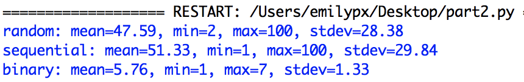
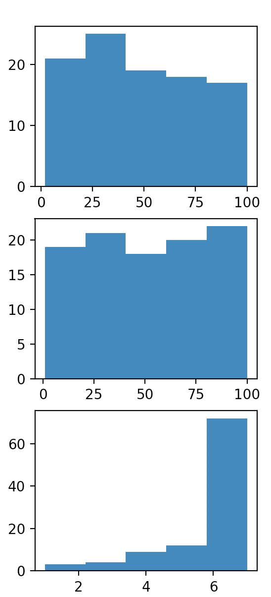

# Problem Set 8

### Due Tuesday, April 6, 2021, at 11:59pm EST

As always, you will submit to Canvas **a single .zip file**. Detailed instructions for what the .zip file should contain are at the end of this problem set. 

**Structure:** Your programs should follow the structure indicated in the program description.

**Comments:** I now expect you to write comments in your code! Two points will be deducted if you provide no or minimal comments, and 1 point will be deducted if you have sufficient comments but they do not conform to the requirements outlined in PS4.

**Folders:** Download this whole directory to your desktop, unzip it, and write all of yoru programs in that folder.

**Honor pledge**: And, as always, in every program, the first four lines (comments) should be your honor pledge.

**Libraries**: Before gettings started make sure you have the following libraries installed:

* NumPy
* Matplotlib
* Pandas

## Part 1: Cereal data
Open `part1.py`. The comments in this file will tell you what you need to do using the libraries NumPy, Pandas, and Matplotlib. Here is what my output looks like, along with the plots I created.

## Part 2: Number guessing
In `part2.py`, **I have provided the code** for guessing a number between 1 and 100 using the three techniques we have discussed and coded up ourselves, with one function for each of the three techniques. Eacn function takes the number to be guessed as an argument and then returns the number of guesses required to guess that number correctly using the specified technique. The three techniques are:

* start guessing at 1 and add 1 until you guess the right number (**sequential**)
* guess random numbers, never guessing the same number twice, until you guess the right number (**random**)
* binary search (**binary**)

You will write a function, `simulateguessing(technique)` whose argumment, `technique` is a string that is either "sequential", "random", or "binary". This function will have a loop that generates a random number between 1 and 100 and then calls the guessing function corresponding to the technique specified by the argument 1000 times. It will save each number it gets back from the guessing function into a list, so that at the end of the loop, it will have a list that is 1000 elements long containing the number of guesses required for each random number it generated. It will return that list.

Finally in your `main()` function, you will do the following:

* Call `simulateguessing()` with each of the three possible values ("sequential", "random", or "binary"). Don't forget that these functions returns a list, which you need to save to a variable, of course!
* Using `numpy`, calculate the mean, min, max, and standard deviation for the result of each call to `simulateguessing()`, and print them out as shown in the sample output, below. ([See the readings about numpy here for some help](https://github.com/CSC1-1101-TTh9-S21/numpy-reading).)
* Using `matplotlib`, create a plot with three subplots, where each subplot contains a histogram for one of the three lists you got back from `simluateguessing()`. 

Here is some sample output, and the subplots that I got.

